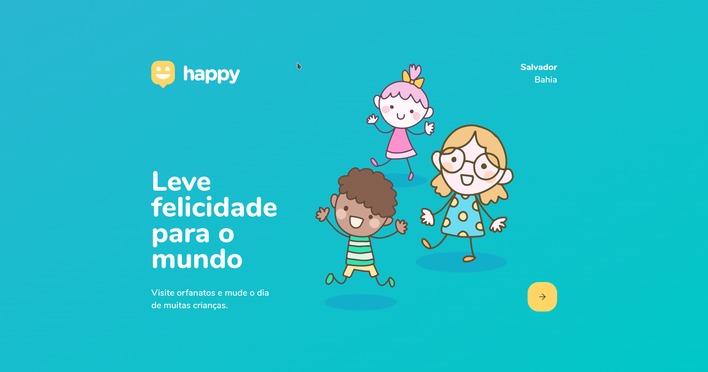
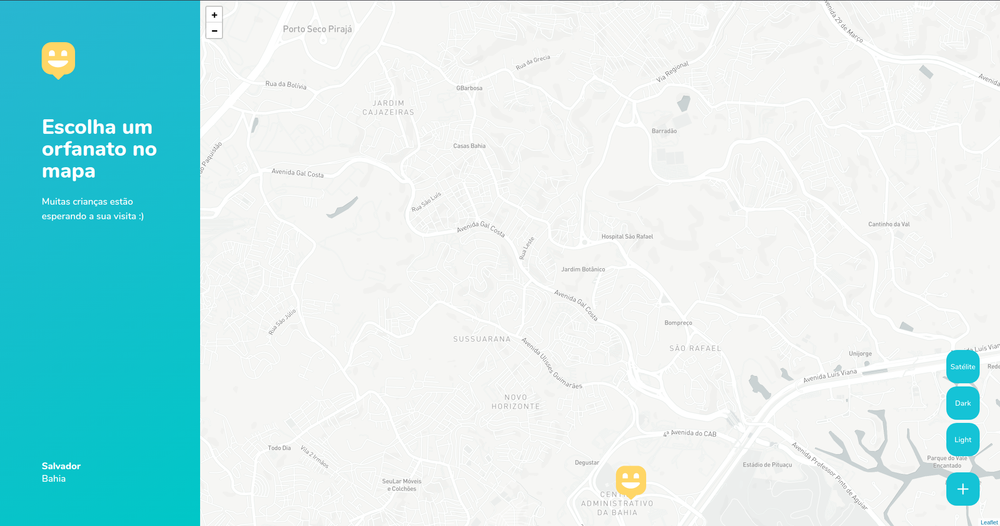
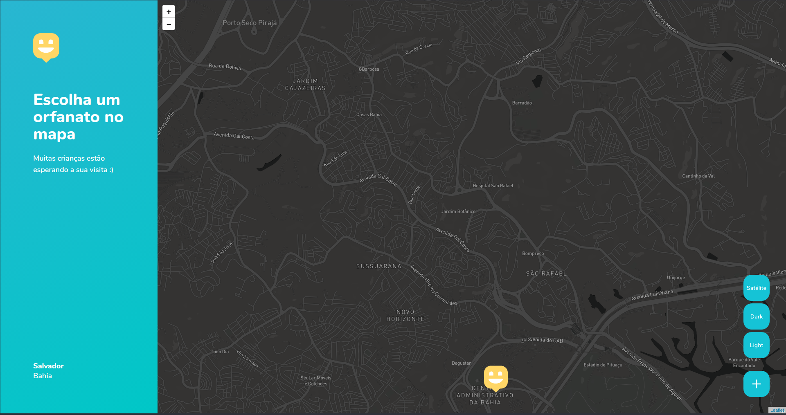
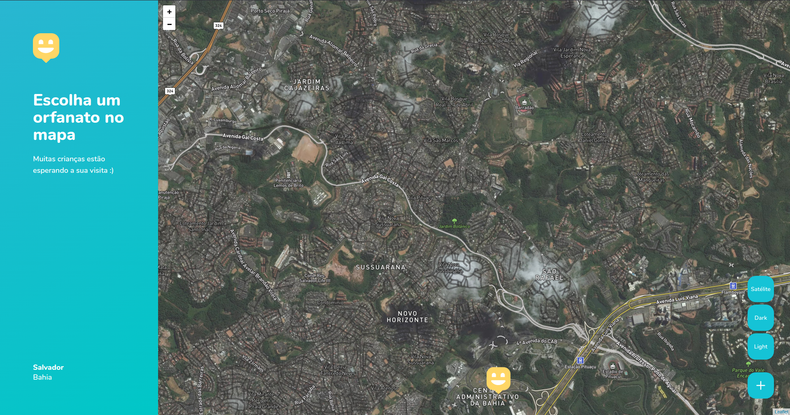
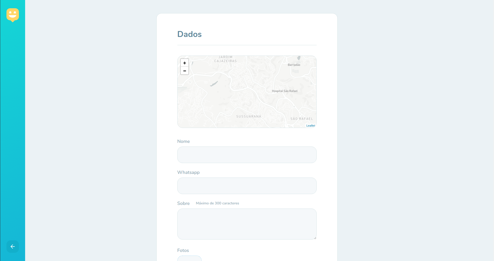
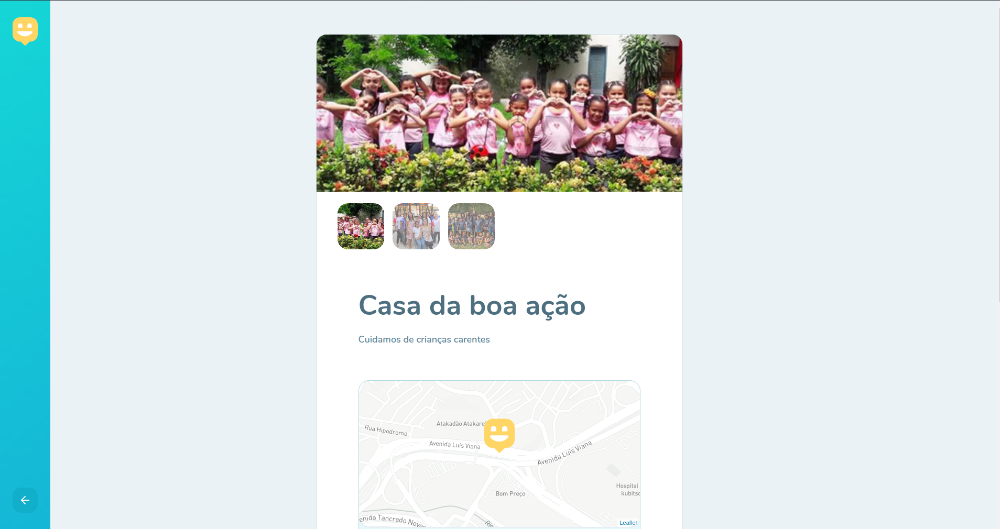
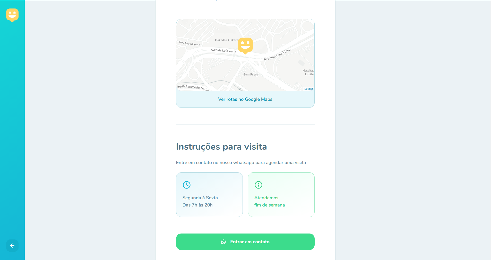
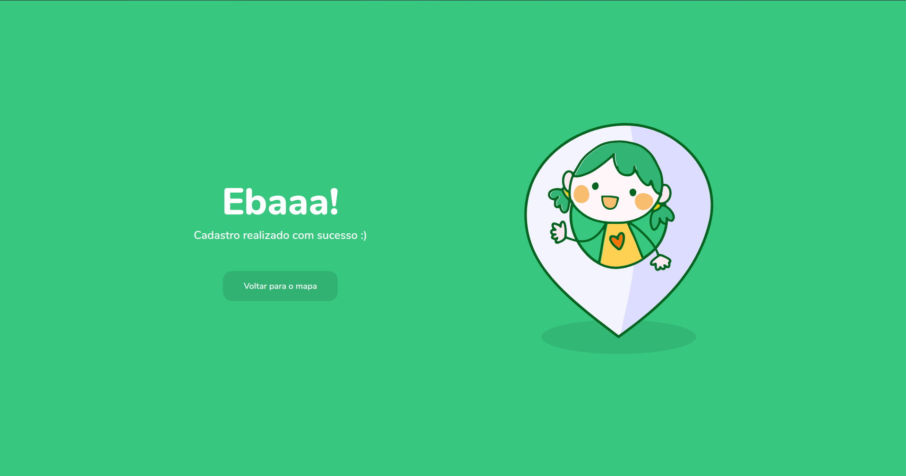

<div align='center'>
  
</div>

---

[](https://reactjs.org/)
[](https://github.com/BrendoSPinheiro/happy-web/blob/master/LICENSE)

---

## Table of Contents
- [📝 About](#-about)
- [📸 Screenshots](#-screenshots)
- [⚙ Functionalities](#-functionalities)
    - [Main features](#main-features)
    - [Features added by me.](#features-added-by-me)
    - [Next Level.](#next-level)
- [🖌 Layout](#-layout)
- [🔥 Installing](#-installing)
    - [First Clone this repositiorie](#first-clone-this-repositiorie)
    - [Install the dependencies](#install-the-dependencies)
    - [Get access token from mapbox](#get-access-token-from-mapbox)
    - [Create environment variable](#create-environment-variable)
    - [API](#api)
- [👨🏽‍💻 Run the project](#-run-the-project)

# 📝 About 
Next-Level-Week (NLW) is an intensive week promoted by RocketSeat 🚀.

This web version allow users to look for orphanages near from yourself.

# 📸 Screenshots










# ⚙ Functionalities

### Main features

&rarr; Map showing all registered orphanages and their location.

&rarr; Register orphanages with their locations and show on the map.

&rarr; Page showing details of the orphanage (name, about, available time, whatsapp contact...

<br/>

### Features added by me.

&rarr; Switch Theme in map ( dark - light - satelite).

&rarr; Added success page after registering an orphanage.

&rarr; Add whatsapp field and send message.

<br/>

### Next Level.

&rarr; Add colors in the respective markers (when registering an orphanage, the author chooses the color).

&rarr; Select marker color: when registering an orphanage, the author chooses the color.

&rarr; Create dashboard.

&rarr; Restricted access to the dashboard only for registered users.

&rarr; Password recovery.

&rarr; Splash Screen at React Native with Expo.

# 🖌 Layout

Layout in figma &rarr;
<a href='https://www.figma.com/file/OYtFKRuGEFKMNgeuiOnK8j/Happy-Web-Copy?node-id=2%3A3'> Figma </a>

# 🔥 Installing

### First Clone this repositiorie

```shell
$ git clone https://github.com/BrendoSPinheiro/happy-web
```
### Install the dependencies
```
$ yarn

# or

$ npm install
```

### Get access token from mapbox

Go to the [MapBox](https://www.mapbox.com/) website and create your account to get the token.

### Create environment variable

Create `.env` in the root directory and then insert the following line of code:

```
REACT_APP_MAPBOX_TOKEN=<Your mapbox access token>
```
### API
Start the [API](https://github.com/BrendoSPinheiro/happy-api) (see its README for more information).


# 👨🏽‍💻 Run the project
```
# yarn
$ yarn dev

# npm
$ npm run dev
```
